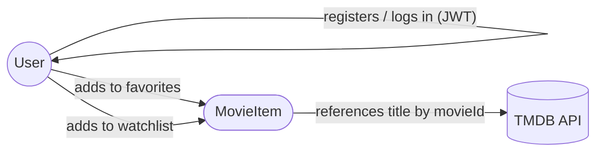
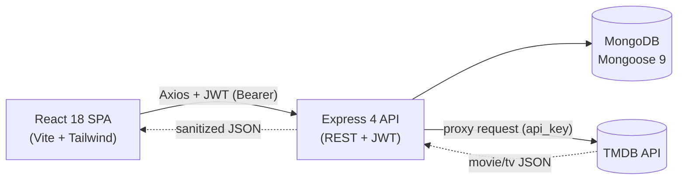

<div align="center">
  <p>
    <strong>🎬 Movie Database</strong>
  </p>

  <h1>Movie Database</h1>

  <p><em>A full-stack movie & TV database with JWT authentication, personal favorites and watchlist, debounced search, and a secure TMDB backend proxy — built on a modern React + Express + MongoDB architecture.</em></p>

  <p>
    
    
    
    
    
    
    
    
    
    
  </p>

  <p>
    <a href="https://movie-databasee.netlify.app/">Live Demo</a> •
    <a href="#features">Features</a> •
    <a href="#installation">Quick Start</a> •
    <a href="#api-endpoints">API Docs</a> •
    <a href="#screenshots">Screenshots</a>
  </p>
</div>

---

## Features

- **Trending Content** — Discover trending movies and TV shows updated daily by TMDB
- **Popular & Top Rated** — Browse curated lists of popular and highest-rated movies
- **Debounced Search** — Search movies and TV shows instantly with optimized debounce logic
- **Detailed Info Pages** — View overview, rating, genres, runtime, and full cast & crew for any title
- **User Authentication** — Secure register and login system with JWT-based stateless authentication
- **Favorites List** — Save and manage your favorite movies and TV shows
- **Watchlist** — Keep track of content you plan to watch later
- **User Profile** — View personal stats, edit profile information, and change password
- **Responsive Design** — Fully responsive layout optimized for mobile, tablet, and desktop
- **Backend Proxy** — TMDB API key stays server-side, never exposed to the client
- **Skeleton Loading** — Smooth loading states with skeleton placeholders for better UX
- **Star Rating Display** — Visual star-based rating component for movie scores
- **Route Protection** — Guest-only and authenticated-only routes with automatic redirects

---

## Live Demo

[🚀 View Live Demo](https://movie-databasee.netlify.app/)

---

## Screenshots

Screenshots are best experienced live — explore the running app on the [live deployment](https://movie-databasee.netlify.app/).

> Image assets can be added under `assets/screenshots/` (e.g. `landing.png`, `detail.png`, `favorites.png`) and embedded here as a grid once captured.

---

## Architecture

A high-level visual map of the system. Both diagrams render natively on GitHub thanks to Mermaid support.

### Domain Model

How the core collections relate to each other and how movie data is sourced.



### Request Lifecycle

How a single browser action travels through the stack. All TMDB traffic is proxied so the API key never reaches the client.



---

## Technologies

### Frontend

- **React 18**: Modern UI library with hooks, context, and component-based architecture
- **Vite 8**: Next-generation build tool with lightning-fast HMR and optimized production builds
- **Tailwind CSS 4**: Utility-first CSS framework via the official Vite plugin
- **React Router 6**: Declarative client-side routing with nested layouts and route guards
- **Axios**: Promise-based HTTP client with interceptors for auth token injection
- **React Hot Toast**: Lightweight toast notification library for user feedback
- **React Icons**: Comprehensive icon library with tree-shaking support

### Backend

- **Node.js**: Server-side JavaScript runtime environment
- **Express 4**: Minimal and flexible web application framework
- **MongoDB (Mongoose 9)**: NoSQL database with elegant object modeling and schema validation
- **JWT (jsonwebtoken)**: Stateless authentication with configurable token expiry
- **bcryptjs 3**: Secure password hashing with automatic salt generation
- **Axios**: Server-side HTTP client for proxying TMDB API requests
- **Swagger (swagger-jsdoc + swagger-ui-express)**: Interactive API documentation at `/api-docs`
- **Morgan**: HTTP request logger for development debugging

---

## Installation

### Prerequisites

- **Node.js** v18+ and **npm**
- **MongoDB** — [MongoDB Atlas](https://www.mongodb.com/atlas) (free tier) or local instance
- **TMDB API Key** (free) — see [Getting a TMDB API Key](#getting-a-tmdb-api-key)

### Getting a TMDB API Key

1. Go to [themoviedb.org](https://www.themoviedb.org/) and create a free account.
2. Navigate to **Settings → API**.
3. Request an API key (choose the **Developer** option).
4. Copy the **API Key (v3 auth)** value.

### Local Development

**1. Clone the repository:**

```bash
git clone https://github.com/serkanbyx/movie-database.git
cd movie-database
```

**2. Set up environment variables:**

```bash
cp server/.env.example server/.env
```

**server/.env**

```env
PORT=5000
MONGODB_URI=mongodb://localhost:27017/moviedb
JWT_SECRET=your_jwt_secret_min_32_characters_here
JWT_EXPIRES_IN=30d
NODE_ENV=development
CLIENT_URL=http://localhost:5173
TMDB_API_KEY=your_tmdb_api_key_here
TMDB_BASE_URL=https://api.themoviedb.org/3
```

**client/.env.production** _(only needed for production builds)_

```env
VITE_API_URL=https://your-api-url.onrender.com/api
```

> In development, Vite's proxy forwards `/api` requests to `http://localhost:5000` automatically — no client `.env` file needed.

**3. Install dependencies:**

```bash
cd server && npm install
cd ../client && npm install
```

**4. Run the application:**

```bash
# Terminal 1 — Backend
cd server && npm run dev

# Terminal 2 — Frontend
cd client && npm run dev
```

The client runs at `http://localhost:5173` and the server at `http://localhost:5000`.

---

## Usage

1. **Browse** — Explore trending, popular, and top-rated movies on the home page
2. **Search** — Use the search bar to find specific movies or TV shows
3. **Register** — Create a new account with username, email, and password
4. **Login** — Sign in to access personalized features
5. **Explore Details** — Click on any title to view full details, ratings, and cast
6. **Favorites** — Click the heart icon to add/remove movies from your favorites
7. **Watchlist** — Click the bookmark icon to add/remove movies from your watchlist
8. **Profile** — View your stats, update your profile info, or change your password
9. **Logout** — Securely sign out from the navigation bar

---

## How It Works?

### Authentication Flow

The application uses JWT-based stateless authentication. On login or register, the server generates a signed JWT token that the client stores in `localStorage`. The Axios interceptor automatically attaches the token to every outgoing request via the `Authorization: Bearer <token>` header.

```javascript
// Request interceptor — auto-attach JWT
api.interceptors.request.use((config) => {
  const token = localStorage.getItem('token');
  if (token) config.headers.Authorization = `Bearer ${token}`;
  return config;
});
```

On a `401` response, the interceptor clears the stored token and redirects the user to the login page.

### Data Flow

All TMDB data flows through the Express backend as a proxy. The client never communicates directly with the TMDB API — this keeps the API key hidden and allows server-side rate limiting:

```
Client (React) → Express API (/api/movies/*) → TMDB API → Express → Client
```

User-specific data (favorites, watchlist, profile) is stored in MongoDB and accessed through authenticated API endpoints.

### Architecture

- **Frontend**: React with Context API for global auth state, custom hooks for reusable logic, and service modules for API abstraction
- **Backend**: MVC pattern with controllers, models, routes, middleware, and validators as separate layers
- **Security**: Multi-layered approach with Helmet, CORS, rate limiting, HPP, input validation, and body size limits

---

## API Endpoints

> Interactive API documentation is available at `/api-docs` (Swagger UI) when the server is running.

### Auth

| Method | Endpoint                    | Auth | Description           |
| ------ | --------------------------- | ---- | --------------------- |
| POST   | `/api/auth/register`        | No   | Register a new user   |
| POST   | `/api/auth/login`           | No   | Login and receive JWT |
| GET    | `/api/auth/me`              | Yes  | Get current user      |
| PUT    | `/api/auth/profile`         | Yes  | Update profile        |
| PUT    | `/api/auth/change-password` | Yes  | Change password       |
| DELETE | `/api/auth/account`         | Yes  | Delete account        |

### Lists (Favorites & Watchlist)

| Method | Endpoint                       | Auth | Description       |
| ------ | ------------------------------ | ---- | ----------------- |
| GET    | `/api/list/status/:movieId`    | Yes  | Check list status |
| GET    | `/api/list/:listType`          | Yes  | Get list items    |
| POST   | `/api/list`                    | Yes  | Add to list       |
| DELETE | `/api/list/:listType/:movieId` | Yes  | Remove from list  |

### Movies & TV (TMDB Proxy)

| Method | Endpoint                             | Auth | Description          |
| ------ | ------------------------------------ | ---- | -------------------- |
| GET    | `/api/movies/trending`               | No   | Trending movies & TV |
| GET    | `/api/movies/search`                 | No   | Search movies & TV   |
| GET    | `/api/movies/popular`                | No   | Popular movies       |
| GET    | `/api/movies/top-rated`              | No   | Top rated movies     |
| GET    | `/api/movies/:mediaType/:id`         | No   | Movie/TV details     |
| GET    | `/api/movies/:mediaType/:id/credits` | No   | Movie/TV credits     |

### Health

| Method | Endpoint      | Auth | Description         |
| ------ | ------------- | ---- | ------------------- |
| GET    | `/api/health` | No   | Server health check |

> Auth endpoints require `Authorization: Bearer <token>` header.

---

## Project Structure

A clean monorepo layout with an explicit backend / frontend split. Each panel below is collapsible — expand the one you care about.

<details open>
<summary><b>Server</b> — Express 4 API</summary>

```
server/
├── config/           # env validation, db connection, swagger spec
├── controllers/      # auth, list, tmdb proxy route handlers
├── middlewares/      # auth (JWT), errorHandler, rateLimiter, validate
├── models/           # User (bcrypt hooks), MovieItem (compound indexes)
├── routes/           # authRoutes, listRoutes, tmdbRoutes
├── utils/            # generateToken, tmdbApi (axios client)
├── validators/       # express-validator schemas per resource
├── index.js          # Express app composition + bootstrap
├── .env.example
└── package.json
```

</details>

<details>
<summary><b>Client</b> — React 18 + Vite SPA</summary>

```
client/
├── src/
│   ├── api/          # Axios instance + interceptors
│   ├── components/   # guards/, layout/, ui/ (cards, skeletons, modals)
│   ├── contexts/     # AuthContext (global auth state)
│   ├── hooks/        # useAuth, useDebounce, useLocalStorage, usePageTitle
│   ├── pages/        # Home, Search, Detail, Favorites, Watchlist, Profile…
│   ├── services/     # authService, listService, tmdbService
│   ├── utils/        # constants, helpers
│   ├── App.jsx       # router + route guards
│   ├── main.jsx      # entry point
│   └── index.css     # global styles (Tailwind)
├── index.html
├── vite.config.js
└── package.json
```

</details>

<details>
<summary><b>Repository root</b> — docs, governance & shared config</summary>

```
movie-database/
├── client/           # → see Client panel above
├── server/           # → see Server panel above
├── .github/          # issue templates, PR template, governance docs
│   ├── ISSUE_TEMPLATE/
│   ├── CODE_OF_CONDUCT.md
│   ├── CONTRIBUTING.md
│   ├── SECURITY.md
│   └── PULL_REQUEST_TEMPLATE.md
├── LICENSE
└── README.md
```

</details>

---

## Security

- **JWT Authentication** — Stateless token-based authentication with configurable expiry and minimum 32-character secret enforcement in production
- **Password Hashing** — bcryptjs with automatic salt generation (12 rounds) for secure password storage
- **Helmet** — Sets various HTTP security headers, including a strict Content Security Policy
- **CORS** — Restricted to allowed client origin(s) with credentials support
- **Rate Limiting** — Three-tier rate limiting: global (500/15min), auth (15/15min), and TMDB (60/1min)
- **HPP** — HTTP Parameter Pollution protection against query string attacks
- **Input Validation** — express-validator on all user inputs with detailed field-level error responses
- **Body Size Limit** — Request body limited to 10KB to prevent payload abuse
- **Backend Proxy** — TMDB API key never exposed to the client browser
- **Fingerprint Prevention** — `x-powered-by` header disabled to hide server technology

---

## Deployment

### Backend (Render)

1. Create a new **Web Service** on [Render](https://render.com/)
2. Connect your GitHub repository
3. Set the following:
   - **Root Directory**: `server`
   - **Build Command**: `npm install`
   - **Start Command**: `npm start`
4. Add environment variables:

| Variable         | Value                                 |
| ---------------- | ------------------------------------- |
| `PORT`           | `5000`                                |
| `MONGODB_URI`    | Your MongoDB Atlas connection string  |
| `JWT_SECRET`     | A secure random string (min 32 chars) |
| `JWT_EXPIRES_IN` | `30d`                                 |
| `NODE_ENV`       | `production`                          |
| `CLIENT_URL`     | `https://movie-databasee.netlify.app` |
| `TMDB_API_KEY`   | Your TMDB API v3 key                  |
| `TMDB_BASE_URL`  | `https://api.themoviedb.org/3`        |

### Frontend (Netlify)

1. Create a new site on [Netlify](https://www.netlify.com/)
2. Connect your GitHub repository
3. Set the following:
   - **Base Directory**: `client`
   - **Build Command**: `npm run build`
   - **Publish Directory**: `client/dist`
4. Add environment variable:

| Variable       | Value                                   |
| -------------- | --------------------------------------- |
| `VITE_API_URL` | `https://your-api-url.onrender.com/api` |

> The `public/_redirects` file handles SPA routing on Netlify by redirecting all paths to `index.html`.

---

## Features in Detail

### Completed Features

- ✅ Browse trending, popular, and top-rated movies
- ✅ Search with debounced input
- ✅ Movie & TV show detail pages with cast
- ✅ JWT authentication (register, login, logout)
- ✅ Favorites and watchlist management
- ✅ User profile with stats and editing
- ✅ Password change functionality
- ✅ Account deletion
- ✅ Responsive design (mobile-first)
- ✅ Skeleton loading states
- ✅ Star rating component
- ✅ Pagination support
- ✅ Route guards (protected & guest-only)
- ✅ Toast notifications
- ✅ Backend proxy for TMDB API
- ✅ Interactive Swagger API documentation

### Future Features

- 🔮 [ ] TV show seasons and episodes detail view
- 🔮 [ ] User reviews and ratings
- 🔮 [ ] Social sharing functionality
- 🔮 [ ] Advanced filtering (by genre, year, rating)
- 🔮 [ ] Dark/light theme toggle
- 🔮 [ ] PWA support for offline access

---

## Contributing

1. **Fork** the repository
2. **Create** a feature branch: `git checkout -b feat/amazing-feature`
3. **Commit** your changes: `git commit -m "feat: add amazing feature"`
4. **Push** to the branch: `git push origin feat/amazing-feature`
5. **Open** a Pull Request

Please review our [Contributing Guidelines](.github/CONTRIBUTING.md) and [Code of Conduct](.github/CODE_OF_CONDUCT.md) before submitting.

### Commit Message Format

| Prefix      | Description                        |
| ----------- | ---------------------------------- |
| `feat:`     | New feature                        |
| `fix:`      | Bug fix                            |
| `refactor:` | Code refactoring                   |
| `docs:`     | Documentation changes              |
| `style:`    | Code style changes (formatting)    |
| `chore:`    | Maintenance and dependency updates |

---

## License

This project is licensed under the [MIT License](LICENSE).

---

## Developer

**Serkanby**

- Website: [serkanbayraktar.com](https://serkanbayraktar.com/)
- GitHub: [@Serkanbyx](https://github.com/Serkanbyx)
- Email: [serkanbyx1@gmail.com](mailto:serkanbyx1@gmail.com)

---

## Acknowledgments

- [TMDB API](https://www.themoviedb.org/) — Movie and TV show data provider
- [React](https://react.dev/) — UI library
- [Vite](https://vite.dev/) — Build tool
- [Tailwind CSS](https://tailwindcss.com/) — CSS framework
- [Express.js](https://expressjs.com/) — Backend framework
- [MongoDB Atlas](https://www.mongodb.com/atlas) — Cloud database

---

## Contact

- 🐛 [Open an Issue](https://github.com/serkanbyx/movie-database/issues)
- 📧 serkanbyx1@gmail.com
- 🌐 [serkanbayraktar.com](https://serkanbayraktar.com/)

---

⭐ If you like this project, don't forget to give it a star!
