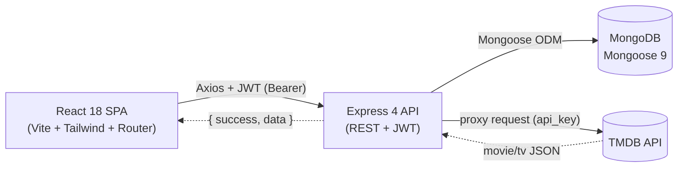

# Movie Database — Step-by-Step Build Guide

> **Archived: original build playbook.** This document is the original roadmap used to build the Movie Database application from an empty folder to a deployed full-stack product. The live codebase may have evolved since this guide was written, so treat it as a making-of narrative rather than a strict source of truth. For current setup, architecture, and deployment notes, see [../README.md](../README.md).

---

> **Project Summary:** Movie Database is a full-stack movie & TV discovery application backed by the TMDB API. Anonymous visitors can browse trending, popular, and top-rated titles, run a debounced multi-search, and open rich detail pages with cast, videos, and similar titles. Authenticated users get JWT-based sessions, a personal favorites list, a watchlist, and a profile area for editing details, changing passwords, and deleting their account. The backend is a security-hardened Express REST API (Helmet, CORS allowlist, three-tier rate limiting, HPP, express-validator, 10KB body cap) that proxies every TMDB request so the API key never reaches the browser, and ships interactive Swagger docs at `/api-docs`. Stack: React 18 + Vite 8 + Tailwind CSS 4 on the client; Express 4 + MongoDB (Mongoose 9) + JWT on the server.

Each step below is a self-contained prompt. Execute them in order.

Stack: React 18, Vite 8, Tailwind CSS 4, React Router 6, Axios, Express 4, MongoDB, Mongoose 9, JWT, bcryptjs, Swagger.

---

## Table of Contents

**PHASE 1 — Backend Foundation**

- STEP 1 — Project Scaffolding & Dependency Setup
- STEP 2 — Environment Validation & Database Connection
- STEP 3 — Express App, Security Middleware & Bootstrap
- STEP 4 — Error Handling & Rate Limiting

**PHASE 2 — Backend Resources**

- STEP 5 — User & MovieItem Models
- STEP 6 — JWT Auth Middleware & Token Utility
- STEP 7 — Auth Resource (validators, controller, routes)
- STEP 8 — Lists Resource (favorites & watchlist)
- STEP 9 — TMDB Proxy Resource
- STEP 10 — Swagger / OpenAPI Documentation

**PHASE 3 — Client Foundation**

- STEP 11 — Vite + Tailwind Scaffolding
- STEP 12 — Axios Instance & Interceptors
- STEP 13 — Service Layer & Constants/Helpers
- STEP 14 — Auth Context, Hooks & Route Guards
- STEP 15 — Layout, Routing & Shared UI Components

**PHASE 4 — Client Pages**

- STEP 16 — Home, Popular & Top Rated Pages
- STEP 17 — Search Page (debounced)
- STEP 18 — Detail Page (cast, credits, list actions)
- STEP 19 — Auth Pages (Login & Register)
- STEP 20 — Favorites, Watchlist & Profile Pages

**PHASE 5 — Polish & Deploy**

- STEP 21 — Loading States, Empty States & Pagination
- STEP 22 — Accessibility, Responsiveness & Performance Pass
- STEP 23 — Deployment (Render + Netlify)

**Appendices**

- Appendix A — Shared Constants & Response Conventions
- Appendix B — Reusable Patterns
- Appendix C — Common Pitfalls
- Appendix D — Pre-flight Checklist

---

## Global Build Rules (apply to EVERY step)

- **No git operations.** Do not run `git` commands, do not commit, and do not push. Version control is handled manually by the user.
- **No unapproved packages.** Only install the dependencies listed in the relevant step. Prefer native methods over new dependencies.
- **No long-running processes** (dev servers, watchers) unless the step explicitly requests it.
- **Each step is self-contained.** Read the goal, touch only the listed files, and verify the acceptance checklist before moving on.
- **Keep secrets out of source.** All secrets live in `.env`; commit only `.env.example` with placeholders.
- **Follow existing conventions.** ES6+, async/await, descriptive camelCase names, DRY, and the established `{ success, data | message }` response shape.

---

## Architecture at a Glance

The system is a monorepo with a clear client/server split. The browser talks only to the Express API; the API owns the database connection and is the single gateway to TMDB.



- **Client**: route-guarded SPA, global auth via Context, service modules wrapping a shared Axios instance.
- **Server**: layered MVC — `routes → middlewares (validate/auth/rateLimit) → controllers → models/utils`.
- **Database**: two collections, `users` and `movieitems`, with compound indexes for uniqueness and fast list queries.
- **Third-party**: TMDB v3 reached exclusively server-side so the API key stays private.

---

# PHASE 1 — BACKEND FOUNDATION

---

## STEP 1 — Project Scaffolding & Dependency Setup

**Goal:** Create the monorepo skeleton and install backend dependencies.

**Files/folders to create:**

```
server/
├── config/
├── controllers/
├── middlewares/
├── models/
├── routes/
├── utils/
├── validators/
├── index.js
└── .env.example
```

**Dependencies (server):**

```bash
cd server && npm init -y
npm install express mongoose dotenv jsonwebtoken bcryptjs cors helmet hpp morgan express-rate-limit express-validator axios swagger-jsdoc swagger-ui-express
npm install --save-dev nodemon
```

**Implementation notes:**

- Set `"type": "commonjs"` in `server/package.json`.
- Add scripts: `"dev": "nodemon index.js"`, `"start": "node index.js"`.
- Create `.env.example` with placeholders for `PORT`, `MONGODB_URI`, `JWT_SECRET`, `JWT_EXPIRES_IN`, `NODE_ENV`, `CLIENT_URL`, `TMDB_API_KEY`, `TMDB_BASE_URL`.

**Acceptance checklist:**

- [ ] Folder structure exists.
- [ ] `npm run dev` fails gracefully (no `index.js` content yet) without dependency errors.

---

## STEP 2 — Environment Validation & Database Connection

**Goal:** Centralize and validate environment variables, and connect to MongoDB.

**Files:** `server/config/env.js`, `server/config/db.js`

**Implementation notes:**

- `env.js` loads `dotenv`, exports a typed `env` object with sensible defaults, and **fails fast**:
  - Throw if `JWT_SECRET` is missing.
  - In production, throw if `JWT_SECRET` is shorter than 32 characters.
  - Throw if `TMDB_API_KEY` is missing or still a `your_*` placeholder.
- `db.js` connects with `mongoose.connect(MONGODB_URI, { serverSelectionTimeoutMS: 5000 })`, logs the host, and calls `process.exit(1)` on failure.

**Acceptance checklist:**

- [ ] Booting without `JWT_SECRET` throws a clear error.
- [ ] A valid `MONGODB_URI` connects and logs the host.

---

## STEP 3 — Express App, Security Middleware & Bootstrap

**Goal:** Compose the Express app with security middleware and an async bootstrap.

**File:** `server/index.js`

**Implementation notes:**

- Wrap startup in `const startServer = async () => { await connectDB(); ... app.listen(PORT) }`.
- Apply, in order:
  - `app.disable('x-powered-by')`
  - `helmet({ contentSecurityPolicy: { directives: { defaultSrc: ["'self'"], imgSrc: ["'self'", "data:", "https://image.tmdb.org"], ... } } })`
  - `cors({ origin: CLIENT_URL.split(',').map(trim), credentials: true })` — support multiple comma-separated origins.
  - `express.json({ limit: '10kb' })` and `express.urlencoded({ extended: true, limit: '10kb' })`
  - `hpp()`
  - `morgan('dev')` only when `NODE_ENV === 'development'`
- Mount a branded HTML landing page at `GET /`, plus `GET /api/health`.

**Acceptance checklist:**

- [ ] `GET /api/health` returns `{ success: true, message: 'Server is running' }`.
- [ ] Security headers present; `x-powered-by` absent.

---

## STEP 4 — Error Handling & Rate Limiting

**Goal:** Add a global error handler and three-tier rate limiting.

**Files:** `server/middlewares/errorHandler.js`, `server/middlewares/rateLimiter.js`, `server/middlewares/validate.js`

**Implementation notes:**

- `errorHandler` maps known errors to status codes: Mongoose `CastError` → 400, duplicate key `11000` → 400 with a friendly field message, `ValidationError` → 400 (joined messages), `JsonWebTokenError`/`TokenExpiredError` → 401. Include `stack` only in development.
- `rateLimiter` exports three limiters with `standardHeaders: true, legacyHeaders: false`:
  - `globalLimiter`: 500 / 15 min
  - `authLimiter`: 15 / 15 min
  - `tmdbLimiter`: 60 / 1 min
- `validate` runs `validationResult(req)` and returns a `400` with a `{ field, message }[]` array on failure.
- Mount `app.use('/api', globalLimiter)` and `app.use(errorHandler)` **last**.

**Acceptance checklist:**

- [ ] Exceeding a limit returns `429` with the shared message.
- [ ] Thrown errors with `statusCode` surface the correct HTTP status.

---

# PHASE 2 — BACKEND RESOURCES

---

## STEP 5 — User & MovieItem Models

**Goal:** Define Mongoose schemas with validation, hashing, and indexes.

**Files:** `server/models/User.js`, `server/models/MovieItem.js`

**Implementation notes:**

- `User`: `username` (unique, 2–30, trimmed), `email` (unique, lowercased, regex-validated), `password` (min 6, `select: false`), `avatar` (default `''`), `createdAt`.
  - `pre('save')` hook hashes the password with `bcrypt.genSalt(12)` only when modified.
  - `comparePassword(candidate)` method wraps `bcrypt.compare`.
- `MovieItem`: `userId` (ref User), `movieId` (Number), `movieTitle` (≤200), `posterPath`, `mediaType` enum `['movie','tv']`, `listType` enum `['favorite','watchlist']`, `voteAverage` (0–10), `releaseDate`, `addedAt`.
  - Compound unique index `{ userId, movieId, listType }` to block duplicates.
  - Secondary index `{ userId, listType, addedAt: -1 }` for fast sorted lists.

**Acceptance checklist:**

- [ ] Passwords are stored hashed, never returned by default.
- [ ] Adding the same title to the same list twice is rejected at the DB level.

---

## STEP 6 — JWT Auth Middleware & Token Utility

**Goal:** Issue and verify JWTs.

**Files:** `server/utils/generateToken.js`, `server/middlewares/auth.js`

**Implementation notes:**

- `generateToken(userId)` signs `{ id: userId }` with `JWT_SECRET` and `expiresIn: JWT_EXPIRES_IN`.
- `protect` middleware: read `Authorization: Bearer <token>`, reject missing/malformed headers with 401, `jwt.verify`, load the user by `decoded.id`, attach `req.user`, and forward verification errors to the error handler.

**Acceptance checklist:**

- [ ] Requests without a valid token to protected routes get `401`.
- [ ] Valid tokens populate `req.user` (without the password field).

---

## STEP 7 — Auth Resource (validators, controller, routes)

**Goal:** Implement register, login, profile, password, and account deletion.

**Files:** `server/validators/authValidator.js`, `server/controllers/authController.js`, `server/routes/authRoutes.js`

**Implementation notes:**

- Validators (express-validator): register (username/email/password), login, updateProfile (optional username + avatar URL that must parse and use `http`/`https`), changePassword, deleteAccount.
- Controller uses a shared `formatUserResponse(user, token)` helper and throws errors with `statusCode` set.
  - `register`: reject if email or username already exists, create user, return `201` + token.
  - `login`: `findOne({ email }).select('+password')`, compare, return token or `401`.
  - `getMe`: return `req.user`.
  - `updateProfile`: `findByIdAndUpdate` with `runValidators`.
  - `changePassword`: verify current password, set new password (re-hash via save hook), issue a fresh token.
  - `deleteAccount`: verify password, delete the user's `MovieItem`s then the user.
- Routes wire `authLimiter` on register/login and `protect` on the rest, with `validate` after each validator chain.

**Acceptance checklist:**

- [ ] Full auth lifecycle works end-to-end.
- [ ] Deleting an account also removes its list items.

---

## STEP 8 — Lists Resource (favorites & watchlist)

**Goal:** CRUD for favorites and watchlist with pagination and status checks.

**Files:** `server/validators/listValidator.js`, `server/controllers/listController.js`, `server/routes/listRoutes.js`

**Implementation notes:**

- Validators: `addToListValidator` (movieId int ≥1, title ≤200, mediaType/listType enums, optional voteAverage 0–10), plus `listTypeParamValidator` and `movieIdParamValidator`.
- Controller:
  - `getList`: clamp `page`/`limit` (limit max 50), run `find` + `countDocuments` via `Promise.all`, return items + pagination.
  - `addToList`: validate enums, reject duplicates, create item, return `201`.
  - `removeFromList`: `findOneAndDelete`, return `404` if absent.
  - `checkListStatus`: `Promise.all` two lookups → `{ isFavorite, isWatchlist }`.
- **Route order matters:** declare `/status/:movieId` before `/:listType` so `status` is not parsed as a list type.

**Acceptance checklist:**

- [ ] Pagination metadata is correct.
- [ ] Status endpoint returns booleans for both lists.

---

## STEP 9 — TMDB Proxy Resource

**Goal:** Proxy TMDB endpoints so the key stays server-side.

**Files:** `server/utils/tmdbApi.js`, `server/controllers/tmdbController.js`, `server/routes/tmdbRoutes.js`

**Implementation notes:**

- `tmdbApi.js`: an Axios instance with `baseURL: TMDB_BASE_URL`, default `params: { api_key }`, and a 10s timeout.
- Controller helpers: `clampPage` (1–500), `buildListResponse(data, results?)` to keep the response shape DRY, `isPositiveInteger`, and `createTmdbError` (404 → 404, otherwise 502).
- Endpoints: `getTrending` (day/week), `searchMovies` (require non-empty `query`, enforce a max length, filter results to movie/tv), `getPopular`, `getTopRated`, `getMovieDetails` (`append_to_response: 'credits,videos,similar'`), `getMovieCredits`.
- Routes: apply `tmdbLimiter` to all, declaring specific routes before parameterized ones.

**Acceptance checklist:**

- [ ] No TMDB key appears in any client-visible response.
- [ ] Invalid `mediaType`/`id` returns `400`; upstream failures return `502`.

---

## STEP 10 — Swagger / OpenAPI Documentation

**Goal:** Serve interactive API docs.

**Files:** `server/config/swagger.js`, wire-up in `server/index.js`

**Implementation notes:**

- Build an OpenAPI 3.0 definition with `swagger-jsdoc`: info (title/version pulled from `package.json`), `BearerAuth` security scheme, reusable schemas (`User`, `MovieItem`, `ErrorResponse`, `ValidationError`), shared responses, and `paths` documenting every endpoint.
- Serve at `/api-docs` with `swagger-ui-express`, hiding the topbar and setting a custom title.

**Acceptance checklist:**

- [ ] `/api-docs` renders and lists Auth, Lists, Movies, Health groups.
- [ ] "Authorize" accepts a Bearer token and protected routes are callable.

---

# PHASE 3 — CLIENT FOUNDATION

---

## STEP 11 — Vite + Tailwind Scaffolding

**Goal:** Scaffold the React SPA.

**Dependencies (client):**

```bash
npm create vite@latest client -- --template react
cd client
npm install axios react-router-dom react-hot-toast react-icons
npm install --save-dev tailwindcss @tailwindcss/vite
```

**Files:** `client/vite.config.js`, `client/src/index.css`, `client/src/main.jsx`

**Implementation notes:**

- `vite.config.js`: register `react()` and `tailwindcss()` plugins; add a dev `server.proxy` mapping `/api` → `http://localhost:5000` with `changeOrigin: true`, port `5173`.
- `index.css`: import Tailwind v4 with `@import "tailwindcss";` plus global base styles.
- `main.jsx`: wrap `<App />` in `StrictMode` → `BrowserRouter` → `AuthProvider`.

**Acceptance checklist:**

- [ ] `npm run dev` serves the app; Tailwind classes apply.
- [ ] `/api` requests proxy to the backend in development.

---

## STEP 12 — Axios Instance & Interceptors

**Goal:** Centralize HTTP config, token injection, and 401 handling.

**File:** `client/src/api/axios.js`

**Implementation notes:**

- Create an instance with `baseURL: import.meta.env.VITE_API_URL || '/api'` and a 15s timeout.
- Request interceptor: attach `Authorization: Bearer <token>` from `localStorage`.
- Response interceptor: return `response.data` directly; on `401`, clear the token and redirect to `/login` (unless already on an auth page).

**Acceptance checklist:**

- [ ] Authenticated requests carry the token automatically.
- [ ] A `401` clears the session and redirects.

---

## STEP 13 — Service Layer & Constants/Helpers

**Goal:** Wrap API endpoints and shared utilities.

**Files:** `client/src/services/{authService,listService,tmdbService}.js`, `client/src/utils/{constants,helpers}.js`

**Implementation notes:**

- Services are thin wrappers around the Axios instance (e.g. `getTrending(page, timeWindow)`, `addToList(payload)`, `loginUser(body)`).
- `constants.js`: TMDB image base + size maps, a `DEFAULT_POSTER` inline SVG, `MEDIA_TYPES`, `LIST_TYPES`.
- `helpers.js`: `getImageUrl`, `formatDate`, `formatRating`, `truncateText`, `getYear`, `getMediaTitle`, `getMediaReleaseDate` (movie vs TV field fallbacks).

**Acceptance checklist:**

- [ ] Pages never import Axios directly — only services.
- [ ] Missing posters fall back to the default SVG.

---

## STEP 14 — Auth Context, Hooks & Route Guards

**Goal:** Global auth state and access control.

**Files:** `client/src/contexts/AuthContext.jsx`, `client/src/hooks/{useAuth,useDebounce,useLocalStorage,usePageTitle}.js`, `client/src/components/guards/{ProtectedRoute,GuestOnlyRoute}.jsx`

**Implementation notes:**

- `AuthProvider`: holds `user`, `token`, `loading`; on mount, verify a stored token via `getMe` and hydrate the user; expose `login`, `register`, `logout`, `updateUser`, `updateToken`, and `isAuthenticated`.
- `useAuth` consumes the context; `useDebounce` powers search; `useLocalStorage` syncs state to storage; `usePageTitle` sets `document.title`.
- `ProtectedRoute` shows a spinner while loading, redirects unauthenticated users to `/login` (preserving `location`). `GuestOnlyRoute` redirects authenticated users away from auth pages.

**Acceptance checklist:**

- [ ] Refreshing keeps the user logged in until the token is invalid.
- [ ] Guards redirect correctly without UI flicker.

---

## STEP 15 — Layout, Routing & Shared UI Components

**Goal:** App shell, routing tree, and reusable UI.

**Files:** `client/src/App.jsx`, `client/src/components/layout/{MainLayout,Navbar,Footer,ScrollToTop}.jsx`, `client/src/components/ui/*`

**Implementation notes:**

- `App.jsx`: nested routes under `MainLayout` (`<Outlet/>`), public + protected (favorites/watchlist/profile) + guest-only (login/register) groups, and a `*` catch-all `NotFoundPage`.
- `MainLayout`: `Navbar` + `ScrollToTop` + content + `Footer`; mount `<Toaster />` for toasts.
- UI primitives: `MovieCard`, `CastCard`, `StarRating`, `Pagination`, `Spinner`, `EmptyState`, `ConfirmModal`, `ListButton`, and skeletons (`MovieCardSkeleton`, `DetailPageSkeleton`).

**Acceptance checklist:**

- [ ] All routes resolve; unknown paths show the 404 page.
- [ ] Navigating between routes scrolls to top.

---

# PHASE 4 — CLIENT PAGES

---

## STEP 16 — Home, Popular & Top Rated Pages

**Goal:** Browse curated TMDB lists.

**Files:** `client/src/pages/{HomePage,PopularPage,TopRatedPage}.jsx`

**Implementation notes:**

- Fetch via `tmdbService`, render a responsive grid of `MovieCard`s, show `MovieCardSkeleton` while loading, and use `Pagination` driven by `total_pages` (clamped to TMDB's 500-page ceiling).
- Home surfaces trending content with a hero/section layout.

**Acceptance checklist:**

- [ ] Grids are responsive and paginate correctly.
- [ ] Loading shows skeletons, not layout shift.

---

## STEP 17 — Search Page (debounced)

**Goal:** Multi-search with debounced input.

**File:** `client/src/pages/SearchPage.jsx`

**Implementation notes:**

- Read/write the query to the URL (`?query=`), debounce with `useDebounce` (~400ms), call `searchMovies`, and render movie/TV results only.
- Handle empty queries and no-result states with `EmptyState`.

**Acceptance checklist:**

- [ ] Typing does not fire a request on every keystroke.
- [ ] Sharing the URL reproduces the search.

---

## STEP 18 — Detail Page (cast, credits, list actions)

**Goal:** Rich detail view for a movie or TV show.

**File:** `client/src/pages/DetailPage.jsx`

**Implementation notes:**

- Route `:mediaType/:id`; fetch details (with appended credits/videos/similar) and render overview, rating (`StarRating`), genres, runtime, and a cast row of `CastCard`s.
- For authenticated users, show favorite/watchlist `ListButton`s wired to `listService` with optimistic toasts; check initial state via the status endpoint.
- Use `DetailPageSkeleton` during load and handle `404`/`502` gracefully.

**Acceptance checklist:**

- [ ] Both movie and TV details render with correct field fallbacks.
- [ ] List toggles persist and reflect server state.

---

## STEP 19 — Auth Pages (Login & Register)

**Goal:** Authentication forms.

**Files:** `client/src/pages/{LoginPage,RegisterPage}.jsx`

**Implementation notes:**

- Controlled forms with client-side validation hints mirroring server rules; submit via `useAuth().login/register`; show server validation errors via toasts.
- Redirect to the intended page (`location.state.from`) or home after success.

**Acceptance checklist:**

- [ ] Successful auth stores the token and updates global state.
- [ ] Field-level server errors are surfaced clearly.

---

## STEP 20 — Favorites, Watchlist & Profile Pages

**Goal:** Personal areas.

**Files:** `client/src/pages/{FavoritesPage,WatchlistPage,ProfilePage}.jsx`, `client/src/components/ui/ListPageContent.jsx`

**Implementation notes:**

- Favorites and Watchlist share a `ListPageContent` component (DRY) that fetches the right `listType`, paginates, supports removal, and shows `EmptyState` when empty.
- Profile shows stats and forms for updating the profile, changing the password (then `updateToken`), and deleting the account behind a `ConfirmModal`.

**Acceptance checklist:**

- [ ] List pages reuse one shared component.
- [ ] Destructive actions require confirmation.

---

# PHASE 5 — POLISH & DEPLOY

---

## STEP 21 — Loading States, Empty States & Pagination

**Goal:** Consistent feedback across the app.

**Implementation notes:**

- Audit every async surface for a skeleton/spinner, an error state, and an empty state.
- Standardize `Pagination` usage and ensure page numbers stay within valid bounds.

**Acceptance checklist:**

- [ ] No raw "blank then pop-in"; every fetch has a placeholder.

---

## STEP 22 — Accessibility, Responsiveness & Performance Pass

**Goal:** Ship an accessible, fast, responsive UI.

**Implementation notes:**

- Add `alt` text, focusable interactive elements, ARIA labels on icon buttons, and visible focus styles.
- Verify mobile/tablet/desktop breakpoints; lazy-load images where helpful.
- Run `npm run lint` (ESLint flat config) and fix warnings.

**Acceptance checklist:**

- [ ] Keyboard navigation works for primary flows.
- [ ] Lint passes with no new warnings.

---

## STEP 23 — Deployment (Render + Netlify)

**Goal:** Deploy the API and the SPA.

**Implementation notes:**

- **Backend (Render):** root `server`, build `npm install`, start `npm start`; set all env vars (`PORT`, `MONGODB_URI`, `JWT_SECRET`, `JWT_EXPIRES_IN`, `NODE_ENV=production`, `CLIENT_URL`, `TMDB_API_KEY`, `TMDB_BASE_URL`).
- **Frontend (Netlify):** base `client`, build `npm run build`, publish `client/dist`; set `VITE_API_URL` to the Render API URL; add a `public/_redirects` file (`/* /index.html 200`) for SPA routing.
- Ensure `CLIENT_URL` on the server matches the Netlify origin for CORS.

**Acceptance checklist:**

- [ ] Live SPA talks to the live API over HTTPS.
- [ ] Deep links work (SPA redirect rule in place).

---

# Appendix A — Shared Constants & Response Conventions

- **Success shape:** `{ success: true, data: ... }` or `{ success: true, message: '...' }`.
- **Error shape:** `{ success: false, message: '...' }`; validation errors add `errors: [{ field, message }]`.
- **Rate limits:** global 500/15min, auth 15/15min, TMDB 60/1min.
- **TMDB pages:** clamp to `1..500`.
- **List pagination:** `limit` defaults to 20, max 50.
- **Image base:** `https://image.tmdb.org/t/p` with size segments (`/w185`, `/w342`, `/w500`, `/original`).

---

# Appendix B — Reusable Patterns

- **Throw-with-statusCode:** create an `Error`, set `error.statusCode`, and `throw` it so the global handler formats the HTTP response.
- **Promise.all for parallel reads:** used in list/status and paginated counts to reduce latency.
- **DRY response builder:** `buildListResponse(data, results?)` keeps TMDB list endpoints consistent.
- **Shared list UI:** `ListPageContent` backs both Favorites and Watchlist.
- **Route ordering:** always declare static segments (`/status/...`, `/trending`) before parameterized ones (`/:listType`, `/:mediaType/:id`).

---

# Appendix C — Common Pitfalls

- **Parameterized route shadowing:** mounting `/:listType` before `/status/:movieId` makes `status` look like a list type — order matters.
- **Selecting the password:** `password` has `select: false`; remember `.select('+password')` for login and password changes.
- **CORS origin mismatch:** `CLIENT_URL` must exactly match the deployed frontend origin; supports comma-separated values.
- **Leaking the TMDB key:** never call TMDB from the client — always go through the proxy.
- **Missing client env in prod:** `VITE_API_URL` must point to the live API; in dev the Vite proxy handles `/api`.
- **JWT secret strength:** production refuses to boot with a secret under 32 characters.

---

# Appendix D — Pre-flight Checklist

- [ ] `server/.env` populated; `.env.example` committed with placeholders only.
- [ ] MongoDB reachable; indexes created on first write.
- [ ] `GET /api/health` returns OK; `/api-docs` renders.
- [ ] Auth lifecycle (register → login → me → update → change-password → delete) verified.
- [ ] Lists add/remove/status/pagination verified.
- [ ] TMDB proxy returns data with no key leakage.
- [ ] Client builds (`npm run build`) and lints cleanly.
- [ ] Deployed CORS, env vars, and SPA redirects confirmed.
